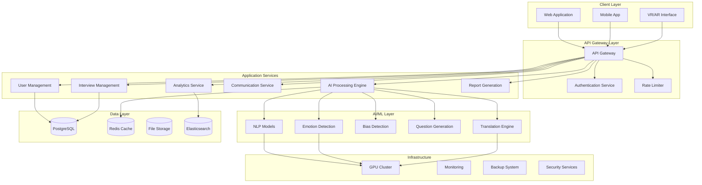
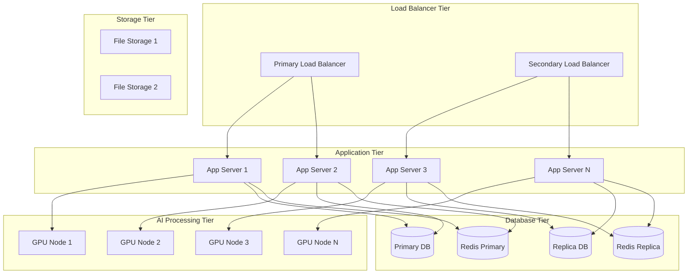

# Design Document

## Overview

The DRDO AI-Powered Interview & Assessment System is designed as a comprehensive, secure, on-premise platform that revolutionizes recruitment through bidirectional AI evaluation. The system simultaneously assesses interviewer question quality and candidate response excellence while providing an immersive, bias-free interview experience. Built with government-grade security and scalability requirements, the platform supports thousands of concurrent interviews while maintaining sub-second AI response times.

The architecture employs microservices patterns with containerized deployment, enabling independent scaling and high availability. The system integrates advanced AI models for natural language processing, emotion detection, and bias mitigation, all operating within DRDO's secure network infrastructure to ensure complete data sovereignty.

## Architecture

### High-Level System Architecture



### Microservices Architecture

The system is decomposed into specialized microservices, each responsible for specific functionality:

#### Core Services
- **Authentication Service**: Multi-factor authentication, role-based access control, session management
- **User Management Service**: User profiles, permissions, organizational hierarchy
- **Interview Management Service**: Session orchestration, scheduling, participant coordination
- **Communication Service**: WebRTC signaling, real-time messaging, video/audio streaming
- **AI Processing Engine**: Centralized AI model inference, result aggregation, performance optimization

#### Specialized Services
- **Question Generation Service**: Adaptive question creation, difficulty calibration, domain-specific content
- **Response Evaluation Service**: Answer analysis, semantic scoring, technical accuracy assessment
- **Bias Detection Service**: Fairness monitoring, pattern analysis, alert generation
- **Translation Service**: Real-time multilingual support, domain-specific terminology
- **Analytics Service**: Performance metrics, trend analysis, predictive insights
- **Report Generation Service**: Dynamic report creation, visualization, export capabilities

### Deployment Architecture



## Components and Interfaces

### Frontend Components

#### React Application Architecture
```typescript
// Core application structure
interface ApplicationState {
  user: UserProfile;
  interview: InterviewSession;
  ai: AIProcessingState;
  communication: CommunicationState;
  analytics: AnalyticsData;
}

// Main application components
const App = () => {
  return (
    <Router>
      <AuthProvider>
        <InterviewProvider>
          <AIProvider>
            <Routes>
              <Route path="/dashboard" component={Dashboard} />
              <Route path="/interview/:id" component={InterviewRoom} />
              <Route path="/analytics" component={Analytics} />
              <Route path="/reports" component={Reports} />
            </Routes>
          </AIProvider>
        </InterviewProvider>
      </AuthProvider>
    </Router>
  );
};
```

#### 3D Boardroom Interface
```typescript
// Three.js integration for immersive experience
interface BoardroomEnvironment {
  scene: THREE.Scene;
  camera: THREE.PerspectiveCamera;
  renderer: THREE.WebGLRenderer;
  avatars: Avatar[];
  lighting: LightingSystem;
  audio: SpatialAudioSystem;
}

class BoardroomManager {
  private environment: BoardroomEnvironment;
  
  initializeEnvironment(): void {
    // Setup 3D scene with realistic boardroom
    // Configure spatial audio
    // Initialize avatar system
    // Setup gesture recognition
  }
  
  updateAvatarExpressions(emotionData: EmotionAnalysis): void {
    // Real-time facial animation based on emotion detection
  }
  
  handleSpatialAudio(participants: Participant[]): void {
    // Directional audio simulation
  }
}
```

#### WebRTC Communication
```typescript
interface CommunicationManager {
  peerConnections: Map<string, RTCPeerConnection>;
  localStream: MediaStream;
  remoteStreams: Map<string, MediaStream>;
}

class WebRTCManager implements CommunicationManager {
  async initializeConnection(participantId: string): Promise<void> {
    // Setup peer connection with STUN/TURN servers
    // Configure media constraints for high-quality video/audio
    // Implement connection recovery mechanisms
  }
  
  async handleScreenShare(): Promise<void> {
    // Enable screen sharing for technical demonstrations
  }
  
  processAudioForAI(audioStream: MediaStream): void {
    // Real-time audio processing for speech recognition
    // Emotion detection from voice patterns
  }
}
```

### Backend API Interfaces

#### Authentication Service API
```typescript
interface AuthenticationAPI {
  // Multi-factor authentication
  POST /auth/login: {
    username: string;
    password: string;
    mfaToken?: string;
  } => AuthResponse;
  
  // Role-based access control
  GET /auth/permissions: {} => UserPermissions;
  
  // Session management
  POST /auth/refresh: { refreshToken: string } => TokenResponse;
  DELETE /auth/logout: {} => void;
}

interface AuthResponse {
  accessToken: string;
  refreshToken: string;
  user: UserProfile;
  permissions: string[];
  expiresIn: number;
}
```

#### Interview Management API
```typescript
interface InterviewAPI {
  // Session management
  POST /interviews: CreateInterviewRequest => Interview;
  GET /interviews/:id: {} => Interview;
  PUT /interviews/:id/start: {} => InterviewSession;
  PUT /interviews/:id/end: {} => InterviewResults;
  
  // Participant management
  POST /interviews/:id/participants: AddParticipantRequest => void;
  DELETE /interviews/:id/participants/:userId: {} => void;
  
  // Real-time updates
  WebSocket /interviews/:id/events: InterviewEvent[];
}

interface CreateInterviewRequest {
  title: string;
  description: string;
  scheduledTime: Date;
  duration: number;
  participants: ParticipantInfo[];
  evaluationCriteria: EvaluationCriteria;
  questionCategories: string[];
}
```

#### AI Processing API
```typescript
interface AIProcessingAPI {
  // Question evaluation
  POST /ai/evaluate-question: {
    question: string;
    candidateProfile: CandidateProfile;
    jobRequirements: JobRequirements;
  } => QuestionEvaluation;
  
  // Answer evaluation
  POST /ai/evaluate-answer: {
    question: string;
    answer: string;
    expectedResponse: string;
    context: InterviewContext;
  } => AnswerEvaluation;
  
  // Real-time translation
  POST /ai/translate: {
    text: string;
    sourceLanguage: string;
    targetLanguage: string;
    domain: string;
  } => TranslationResult;
  
  // Emotion analysis
  POST /ai/analyze-emotion: {
    videoFrame: Blob;
    audioChunk: Blob;
  } => EmotionAnalysis;
  
  // Bias detection
  POST /ai/detect-bias: {
    interviewData: InterviewData;
    demographicData: DemographicData;
  } => BiasAnalysis;
}
```

### AI Model Interfaces

#### Natural Language Processing Models
```python
class SemanticAnalyzer:
    def __init__(self):
        self.sentence_bert = SentenceTransformer('all-MiniLM-L6-v2')
        self.roberta = RobertaForSequenceClassification.from_pretrained('roberta-base')
        self.domain_embeddings = self.load_drdo_embeddings()
    
    def evaluate_semantic_similarity(self, question: str, answer: str) -> float:
        """Calculate semantic similarity between question and answer"""
        question_embedding = self.sentence_bert.encode(question)
        answer_embedding = self.sentence_bert.encode(answer)
        return cosine_similarity([question_embedding], [answer_embedding])[0][0]
    
    def assess_technical_depth(self, response: str, domain: str) -> TechnicalDepthScore:
        """Evaluate technical sophistication of response"""
        # Implementation for technical depth analysis
        pass
```

#### Question Generation Engine
```python
class AdaptiveQuestionGenerator:
    def __init__(self):
        self.t5_model = T5ForConditionalGeneration.from_pretrained('t5-base')
        self.difficulty_calibrator = DifficultyAssessment()
        self.knowledge_graph = DRDOKnowledgeGraph()
    
    def generate_followup_question(
        self, 
        previous_qa: List[QuestionAnswer], 
        candidate_profile: CandidateProfile,
        remaining_time: int
    ) -> GeneratedQuestion:
        """Generate contextually appropriate follow-up questions"""
        # Analyze candidate knowledge level from previous responses
        # Select appropriate difficulty and topic
        # Generate question using T5 model
        # Validate question quality and relevance
        pass
```

#### Emotion Detection System
```python
class EmotionAnalysisEngine:
    def __init__(self):
        self.facial_analyzer = FacialExpressionRecognizer()
        self.voice_analyzer = VoiceEmotionDetector()
        self.stress_detector = StressIndicatorAnalyzer()
    
    def analyze_multimodal_emotion(
        self, 
        video_frame: np.ndarray, 
        audio_chunk: np.ndarray
    ) -> EmotionState:
        """Combine visual and audio cues for emotion detection"""
        facial_emotions = self.facial_analyzer.detect_emotions(video_frame)
        voice_emotions = self.voice_analyzer.analyze_prosody(audio_chunk)
        stress_level = self.stress_detector.calculate_stress(video_frame, audio_chunk)
        
        return EmotionState(
            confidence=facial_emotions.confidence,
            stress_level=stress_level,
            engagement=self.calculate_engagement(facial_emotions, voice_emotions),
            dominant_emotion=self.fuse_emotion_signals(facial_emotions, voice_emotions)
        )
```

## Data Models

### Core Data Structures

#### User and Authentication Models
```typescript
interface UserProfile {
  id: string;
  username: string;
  email: string;
  fullName: string;
  role: UserRole;
  department: string;
  expertise: string[];
  securityClearance: SecurityLevel;
  createdAt: Date;
  lastLogin: Date;
  isActive: boolean;
}

enum UserRole {
  ADMINISTRATOR = 'administrator',
  SELECTOR = 'selector',
  CANDIDATE = 'candidate',
  OBSERVER = 'observer'
}

enum SecurityLevel {
  PUBLIC = 'public',
  RESTRICTED = 'restricted',
  CONFIDENTIAL = 'confidential',
  SECRET = 'secret'
}
```

#### Interview Session Models
```typescript
interface Interview {
  id: string;
  title: string;
  description: string;
  status: InterviewStatus;
  scheduledTime: Date;
  actualStartTime?: Date;
  actualEndTime?: Date;
  duration: number;
  participants: Participant[];
  evaluationCriteria: EvaluationCriteria;
  questionCategories: string[];
  settings: InterviewSettings;
  results?: InterviewResults;
  createdBy: string;
  createdAt: Date;
  updatedAt: Date;
}

interface Participant {
  userId: string;
  role: ParticipantRole;
  joinedAt?: Date;
  leftAt?: Date;
  connectionQuality: ConnectionQuality;
  deviceInfo: DeviceInfo;
}

enum InterviewStatus {
  SCHEDULED = 'scheduled',
  IN_PROGRESS = 'in_progress',
  COMPLETED = 'completed',
  CANCELLED = 'cancelled',
  TECHNICAL_ISSUES = 'technical_issues'
}
```

#### AI Evaluation Models
```typescript
interface QuestionEvaluation {
  questionId: string;
  relevanceScore: number;
  difficultyScore: number;
  clarityScore: number;
  biasScore: number;
  overallScore: number;
  feedback: string;
  suggestions: string[];
  evaluatedAt: Date;
}

interface AnswerEvaluation {
  answerId: string;
  semanticRelevance: number;
  technicalAccuracy: number;
  communicationQuality: number;
  depthOfUnderstanding: number;
  overallScore: number;
  strengths: string[];
  improvementAreas: string[];
  factualErrors: FactualError[];
  evaluatedAt: Date;
}

interface EmotionAnalysis {
  timestamp: Date;
  confidence: number;
  stressLevel: number;
  engagement: number;
  dominantEmotion: Emotion;
  facialExpressions: FacialExpression[];
  voiceIndicators: VoiceIndicator[];
}
```

### Database Schema Design

#### PostgreSQL Schema
```sql
-- Users and Authentication
CREATE TABLE users (
    id UUID PRIMARY KEY DEFAULT gen_random_uuid(),
    username VARCHAR(50) UNIQUE NOT NULL,
    email VARCHAR(255) UNIQUE NOT NULL,
    password_hash VARCHAR(255) NOT NULL,
    full_name VARCHAR(255) NOT NULL,
    role user_role NOT NULL,
    department VARCHAR(100),
    expertise TEXT[],
    security_clearance security_level NOT NULL,
    is_active BOOLEAN DEFAULT true,
    created_at TIMESTAMP WITH TIME ZONE DEFAULT NOW(),
    updated_at TIMESTAMP WITH TIME ZONE DEFAULT NOW()
);

-- Interview Sessions
CREATE TABLE interviews (
    id UUID PRIMARY KEY DEFAULT gen_random_uuid(),
    title VARCHAR(255) NOT NULL,
    description TEXT,
    status interview_status NOT NULL DEFAULT 'scheduled',
    scheduled_time TIMESTAMP WITH TIME ZONE NOT NULL,
    actual_start_time TIMESTAMP WITH TIME ZONE,
    actual_end_time TIMESTAMP WITH TIME ZONE,
    duration INTEGER NOT NULL, -- in minutes
    evaluation_criteria JSONB NOT NULL,
    question_categories TEXT[],
    settings JSONB NOT NULL,
    results JSONB,
    created_by UUID REFERENCES users(id),
    created_at TIMESTAMP WITH TIME ZONE DEFAULT NOW(),
    updated_at TIMESTAMP WITH TIME ZONE DEFAULT NOW()
);

-- AI Evaluations
CREATE TABLE question_evaluations (
    id UUID PRIMARY KEY DEFAULT gen_random_uuid(),
    interview_id UUID REFERENCES interviews(id),
    question_text TEXT NOT NULL,
    relevance_score DECIMAL(3,2),
    difficulty_score DECIMAL(3,2),
    clarity_score DECIMAL(3,2),
    bias_score DECIMAL(3,2),
    overall_score DECIMAL(3,2),
    feedback TEXT,
    suggestions TEXT[],
    evaluated_at TIMESTAMP WITH TIME ZONE DEFAULT NOW()
);

CREATE TABLE answer_evaluations (
    id UUID PRIMARY KEY DEFAULT gen_random_uuid(),
    interview_id UUID REFERENCES interviews(id),
    question_id UUID REFERENCES question_evaluations(id),
    answer_text TEXT NOT NULL,
    semantic_relevance DECIMAL(3,2),
    technical_accuracy DECIMAL(3,2),
    communication_quality DECIMAL(3,2),
    depth_of_understanding DECIMAL(3,2),
    overall_score DECIMAL(3,2),
    strengths TEXT[],
    improvement_areas TEXT[],
    factual_errors JSONB,
    evaluated_at TIMESTAMP WITH TIME ZONE DEFAULT NOW()
);
```

#### Redis Caching Strategy
```typescript
interface CacheStrategy {
  // User sessions (TTL: 24 hours)
  userSessions: {
    key: `session:${userId}`;
    value: UserSession;
    ttl: 86400;
  };
  
  // AI model results (TTL: 1 hour)
  aiResults: {
    key: `ai:${modelType}:${inputHash}`;
    value: AIResult;
    ttl: 3600;
  };
  
  // Interview state (TTL: Interview duration + 1 hour)
  interviewState: {
    key: `interview:${interviewId}:state`;
    value: InterviewState;
    ttl: 'dynamic';
  };
  
  // Question banks (TTL: 7 days)
  questionBanks: {
    key: `questions:${domain}:${difficulty}`;
    value: Question[];
    ttl: 604800;
  };
}
```

## Error Handling

### Error Classification and Response Strategy

#### Client-Side Error Handling
```typescript
class ErrorHandler {
  static handleAPIError(error: APIError): void {
    switch (error.type) {
      case 'AUTHENTICATION_ERROR':
        // Redirect to login, clear tokens
        AuthService.logout();
        Router.push('/login');
        break;
        
      case 'NETWORK_ERROR':
        // Show offline indicator, queue requests
        OfflineManager.handleNetworkError(error);
        break;
        
      case 'VALIDATION_ERROR':
        // Display field-specific validation messages
        FormValidator.displayErrors(error.details);
        break;
        
      case 'AI_PROCESSING_ERROR':
        // Fallback to manual evaluation mode
        InterviewManager.switchToManualMode();
        break;
        
      default:
        // Generic error handling
        NotificationService.showError(error.message);
    }
  }
}
```

#### Server-Side Error Handling
```python
class APIErrorHandler:
    def __init__(self):
        self.logger = logging.getLogger(__name__)
    
    def handle_ai_model_error(self, error: AIModelError) -> ErrorResponse:
        """Handle AI model processing failures"""
        self.logger.error(f"AI model error: {error}")
        
        # Attempt model fallback
        if error.model_type == 'primary':
            return self.fallback_to_secondary_model(error.input_data)
        
        # If all models fail, return manual evaluation flag
        return ErrorResponse(
            code='AI_UNAVAILABLE',
            message='AI evaluation temporarily unavailable',
            fallback_mode='manual_evaluation'
        )
    
    def handle_database_error(self, error: DatabaseError) -> ErrorResponse:
        """Handle database connection and query errors"""
        if error.type == 'CONNECTION_TIMEOUT':
            # Retry with exponential backoff
            return self.retry_with_backoff(error.operation)
        
        elif error.type == 'CONSTRAINT_VIOLATION':
            # Return user-friendly validation error
            return ErrorResponse(
                code='VALIDATION_ERROR',
                message='Data validation failed',
                details=self.parse_constraint_error(error)
            )
```

#### Interview Session Error Recovery
```typescript
class InterviewErrorRecovery {
  static async handleConnectionLoss(interviewId: string): Promise<void> {
    // Attempt automatic reconnection
    const reconnected = await this.attemptReconnection(interviewId);
    
    if (!reconnected) {
      // Switch to phone backup mode
      await this.initiatePhoneBackup(interviewId);
      
      // Notify all participants
      NotificationService.broadcast(interviewId, {
        type: 'CONNECTION_BACKUP',
        message: 'Switched to phone backup mode'
      });
    }
  }
  
  static async handleAIServiceFailure(interviewId: string): Promise<void> {
    // Switch to manual evaluation mode
    await InterviewService.switchToManualMode(interviewId);
    
    // Notify selectors about manual evaluation
    NotificationService.notifySelectors(interviewId, {
      type: 'AI_FALLBACK',
      message: 'AI evaluation unavailable, switched to manual mode'
    });
  }
}
```

## Testing Strategy

### Comprehensive Testing Framework

#### Unit Testing Strategy
```typescript
// AI Model Testing
describe('SemanticAnalyzer', () => {
  let analyzer: SemanticAnalyzer;
  
  beforeEach(() => {
    analyzer = new SemanticAnalyzer();
  });
  
  test('should evaluate semantic similarity correctly', async () => {
    const question = "Explain the principles of radar technology";
    const goodAnswer = "Radar uses electromagnetic waves to detect objects";
    const poorAnswer = "I like programming";
    
    const goodScore = await analyzer.evaluateSemanticSimilarity(question, goodAnswer);
    const poorScore = await analyzer.evaluateSemanticSimilarity(question, poorAnswer);
    
    expect(goodScore).toBeGreaterThan(0.7);
    expect(poorScore).toBeLessThan(0.3);
  });
  
  test('should detect technical depth accurately', async () => {
    const technicalResponse = "The Doppler effect in radar systems allows measurement of target velocity by analyzing frequency shifts in reflected signals";
    const shallowResponse = "Radar detects things";
    
    const technicalScore = await analyzer.assessTechnicalDepth(technicalResponse, 'electronics');
    const shallowScore = await analyzer.assessTechnicalDepth(shallowResponse, 'electronics');
    
    expect(technicalScore.depth).toBeGreaterThan(shallowScore.depth);
  });
});
```

#### Integration Testing
```python
class TestInterviewWorkflow:
    def setup_method(self):
        self.client = TestClient(app)
        self.test_user = self.create_test_user()
        self.test_interview = self.create_test_interview()
    
    def test_complete_interview_flow(self):
        """Test end-to-end interview process"""
        # Start interview session
        response = self.client.post(f"/interviews/{self.test_interview.id}/start")
        assert response.status_code == 200
        
        # Submit question for evaluation
        question_data = {
            "question": "Describe the working principle of a jet engine",
            "candidateProfile": self.test_candidate_profile,
            "jobRequirements": self.test_job_requirements
        }
        
        question_response = self.client.post("/ai/evaluate-question", json=question_data)
        assert question_response.status_code == 200
        assert question_response.json()["overallScore"] > 0.5
        
        # Submit answer for evaluation
        answer_data = {
            "question": question_data["question"],
            "answer": "A jet engine works by compressing air, mixing it with fuel, igniting the mixture, and expelling hot gases to create thrust",
            "expectedResponse": "Technical explanation of jet propulsion",
            "context": {"domain": "aerospace"}
        }
        
        answer_response = self.client.post("/ai/evaluate-answer", json=answer_data)
        assert answer_response.status_code == 200
        assert answer_response.json()["overallScore"] > 0.7
```

#### Performance Testing
```python
class TestPerformanceRequirements:
    def test_ai_response_time(self):
        """Ensure AI processing meets <200ms requirement"""
        start_time = time.time()
        
        response = self.client.post("/ai/evaluate-answer", json=self.sample_data)
        
        end_time = time.time()
        response_time = (end_time - start_time) * 1000  # Convert to milliseconds
        
        assert response_time < 200, f"Response time {response_time}ms exceeds 200ms requirement"
    
    def test_concurrent_interviews(self):
        """Test system capacity for concurrent interviews"""
        import asyncio
        import aiohttp
        
        async def simulate_interview():
            async with aiohttp.ClientSession() as session:
                # Simulate interview activities
                await session.post("/interviews", json=self.interview_data)
                await session.post("/ai/evaluate-question", json=self.question_data)
                await session.post("/ai/evaluate-answer", json=self.answer_data)
        
        # Test with 1000 concurrent interviews
        tasks = [simulate_interview() for _ in range(1000)]
        start_time = time.time()
        
        asyncio.run(asyncio.gather(*tasks))
        
        end_time = time.time()
        total_time = end_time - start_time
        
        assert total_time < 60, f"1000 concurrent interviews took {total_time}s, should be under 60s"
```

#### Security Testing
```python
class TestSecurityRequirements:
    def test_authentication_required(self):
        """Ensure all endpoints require authentication"""
        protected_endpoints = [
            "/interviews",
            "/ai/evaluate-question",
            "/ai/evaluate-answer",
            "/analytics/reports"
        ]
        
        for endpoint in protected_endpoints:
            response = self.client.get(endpoint)
            assert response.status_code == 401, f"Endpoint {endpoint} should require authentication"
    
    def test_role_based_access(self):
        """Test role-based access control"""
        candidate_token = self.get_candidate_token()
        admin_token = self.get_admin_token()
        
        # Candidates should not access admin endpoints
        response = self.client.get("/admin/users", headers={"Authorization": f"Bearer {candidate_token}"})
        assert response.status_code == 403
        
        # Admins should have full access
        response = self.client.get("/admin/users", headers={"Authorization": f"Bearer {admin_token}"})
        assert response.status_code == 200
    
    def test_data_encryption(self):
        """Verify data encryption at rest and in transit"""
        # Test database encryption
        encrypted_data = self.db.execute("SELECT password_hash FROM users LIMIT 1").fetchone()
        assert not encrypted_data[0].startswith("plain_"), "Passwords should be encrypted"
        
        # Test API encryption (TLS)
        response = requests.get("https://interview-platform.drdo.gov.in/health")
        assert response.url.startswith("https://"), "All traffic should use HTTPS"
```

This comprehensive design document provides the technical foundation for implementing the DRDO AI-Powered Interview & Assessment System. The architecture balances scalability, security, and performance requirements while enabling the advanced AI capabilities outlined in the requirements document.

<function_calls>
<invoke name="userInput">
<parameter name="question">**Does the design look good? If so, we can move on to the implementation plan.**