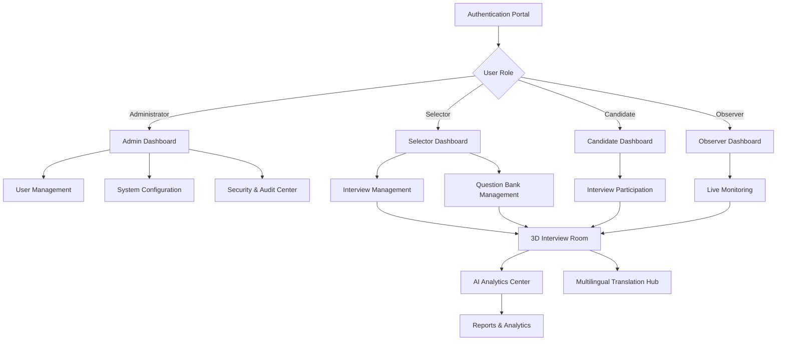

# DRDO AI-Powered Interview & Assessment System - Product Requirements Document

## 1. Product Overview

The DRDO AI-Powered Interview & Assessment System is a revolutionary web-based platform designed for DRDO's Recruitment and Assessment Centre (RAC) that eliminates bias, standardizes evaluation, and provides quantifiable, transparent hiring decisions through advanced AI technology. The platform features bidirectional AI evaluation that simultaneously assesses both interviewer question quality and candidate response excellence while providing an immersive boardroom simulation experience.

This system addresses critical challenges in government recruitment by providing real-time multilingual support, emotion analysis, bias detection, and adaptive questioning capabilities. The platform is designed to handle 10,000+ concurrent interviews with sub-200ms AI response times while maintaining government-grade security and compliance standards.

## 2. Core Features

### 2.1 User Roles

| Role | Registration Method | Core Permissions |
|------|---------------------|------------------|
| Administrator | System-assigned with security clearance verification | Full system access, user management, security configuration, audit trail access |
| Selector | Department nomination with role-based approval | Interview creation, candidate evaluation, question management, analytics access |
| Candidate | Invitation-based registration with identity verification | Interview participation, profile management, result viewing |
| Observer | Authorized personnel with viewing permissions | Real-time interview monitoring, report access (read-only) |

### 2.2 Feature Module

Our DRDO AI-Powered Interview System consists of the following main pages:

1. **Authentication Portal**: Multi-factor authentication, role-based access control, security clearance verification.
2. **Dashboard**: Personalized interface showing upcoming interviews, performance analytics, system notifications, quick actions.
3. **Interview Management**: Session creation, participant management, scheduling, configuration of evaluation criteria and question categories.
4. **3D Interview Room**: Immersive boardroom environment with spatial audio, real-time communication, AI-powered evaluation interface.
5. **AI Analytics Center**: Real-time scoring visualization, bias detection alerts, performance metrics, predictive analytics.
6. **Question Bank Management**: Adaptive question generation, domain-specific content, difficulty calibration, bias checking.
7. **Multilingual Translation Hub**: Real-time speech-to-speech translation, domain-specific terminology, accent adaptation.
8. **Reports & Analytics**: Comprehensive reporting, comparative analysis, trend visualization, export capabilities.
9. **Security & Audit Center**: Blockchain audit trails, compliance monitoring, security incident management.
10. **System Administration**: User management, system configuration, performance monitoring, backup management.

### 2.3 Page Details

| Page Name | Module Name | Feature Description |
|-----------|-------------|---------------------|
| Authentication Portal | Multi-Factor Authentication | Implement secure login with username/password, OTP verification, biometric authentication options, session management with time-limited tokens |
| Authentication Portal | Role-Based Access Control | Assign user roles with granular permissions, security clearance verification, access logging and monitoring |
| Dashboard | Personalized Interface | Display role-specific dashboard with upcoming interviews, performance summaries, system notifications, quick action buttons |
| Dashboard | Real-Time Notifications | Show live updates for interview invitations, system alerts, performance feedback, security notifications |
| Interview Management | Session Creation | Create interview sessions with configurable parameters (duration, categories, criteria), participant invitation system, automated scheduling |
| Interview Management | Participant Coordination | Manage interviewer and candidate assignments, send automated notifications, handle rescheduling and cancellations |
| 3D Interview Room | Immersive Environment | Render photorealistic boardroom with customizable layouts, professional 3D avatars, dynamic lighting based on time/mood |
| 3D Interview Room | Real-Time Communication | WebRTC-based video/audio streaming, spatial audio simulation, screen sharing capabilities, gesture recognition |
| 3D Interview Room | AI Evaluation Interface | Real-time question and answer scoring, bias detection alerts, emotion analysis display, adaptive questioning suggestions |
| AI Analytics Center | Bidirectional Scoring | Evaluate interviewer questions (relevance 30%, difficulty 25%, clarity 20%, flow 15%, bias 10%) and candidate answers (semantic relevance 40%, technical accuracy 40%, communication 15%, depth 5%) |
| AI Analytics Center | Bias Detection Engine | Statistical disparate impact analysis, linguistic bias identification, scoring irregularity flagging, demographic privacy protection |
| AI Analytics Center | Emotion & Stress Analysis | Facial micro-expression detection, voice stress analysis, engagement tracking, real-time adjustment recommendations |
| Question Bank Management | Adaptive Generation | Generate contextually appropriate questions using T5 models, difficulty calibration, domain-specific content creation |
| Question Bank Management | Quality Assurance | Validate question relevance, check for bias, ensure technical accuracy, maintain question flow logic |
| Multilingual Translation Hub | Real-Time Translation | Speech-to-speech translation with <2 second latency, domain-specific DRDO terminology, accent adaptation |
| Multilingual Translation Hub | Language Processing | Support multiple Indian languages, maintain semantic accuracy, store original and translated versions |
| Reports & Analytics | Comprehensive Reporting | Generate detailed interview reports in PDF/HTML/JSON formats, performance analytics, comparative analysis |
| Reports & Analytics | Predictive Analytics | ML-based success probability modeling, trend analysis, peer benchmarking with privacy preservation |
| Security & Audit Center | Blockchain Audit Trail | Maintain immutable interview records, compliance tracking, security incident logging |
| Security & Audit Center | Compliance Management | GDPR, ISO 27001, Indian IT Act compliance monitoring, audit report generation |
| System Administration | User Management | Create/modify user accounts, assign roles and permissions, monitor user activity, enforce security policies |
| System Administration | System Monitoring | Real-time performance tracking, resource utilization monitoring, automated scaling, disaster recovery management |

## 3. Core Process

### Administrator Flow
Administrators begin by accessing the system through multi-factor authentication, then proceed to the administration dashboard where they can manage users, configure system settings, monitor security compliance, and access comprehensive audit trails. They can create user accounts with appropriate security clearances, configure interview parameters, and monitor system performance across all components.

### Selector Flow
Selectors authenticate and access their personalized dashboard showing scheduled interviews and performance analytics. They create new interview sessions by configuring evaluation criteria, question categories, and participant lists. During interviews, they join the 3D boardroom environment where they can ask questions while receiving real-time AI feedback on question quality, bias detection alerts, and candidate evaluation insights. Post-interview, they access comprehensive reports and analytics for decision-making.

### Candidate Flow
Candidates receive interview invitations and authenticate using their credentials. They access their dashboard to view upcoming interviews and preparation materials. During interviews, they join the immersive 3D boardroom where they interact naturally while the system provides real-time translation support if needed. Their responses are evaluated by AI for semantic relevance, technical accuracy, and communication quality, with constructive feedback provided post-interview.

### Observer Flow
Authorized observers can monitor live interviews through the observation interface, accessing real-time analytics and evaluation metrics without disrupting the interview process. They can generate reports and access historical data for quality assurance and training purposes.

## 4. User Interface Design

### 4.1 Design Style

- **Primary Colors**: Deep Navy Blue (#1e3a8a) for authority and trust, Emerald Green (#059669) for success and progress
- **Secondary Colors**: Warm Gray (#6b7280) for neutral elements, Amber (#f59e0b) for warnings and alerts
- **Button Style**: Modern rounded corners (8px radius) with subtle shadows, gradient backgrounds for primary actions, flat design for secondary actions
- **Typography**: Inter font family for excellent readability, 16px base size for body text, 24px+ for headings, proper contrast ratios for accessibility
- **Layout Style**: Card-based design with clean white backgrounds, generous whitespace, responsive grid system, top navigation with breadcrumbs
- **Icon Style**: Heroicons for consistency, 24px standard size, outlined style for better clarity, contextual colors matching the action type

### 4.2 Page Design Overview

| Page Name | Module Name | UI Elements |
|-----------|-------------|-------------|
| Authentication Portal | Login Interface | Centered card layout with DRDO branding, multi-step authentication flow, biometric integration options, security indicators, responsive design for mobile devices |
| Dashboard | Overview Cards | Grid layout with metric cards showing key statistics, color-coded status indicators, interactive charts using Chart.js, notification panel with real-time updates |
| Interview Management | Session Builder | Step-by-step wizard interface, drag-and-drop participant assignment, calendar integration, configuration panels with validation, progress indicators |
| 3D Interview Room | Immersive Environment | Full-screen 3D canvas with WebGL rendering, floating UI panels for controls, spatial audio controls, real-time video feeds, AI feedback overlays |
| AI Analytics Center | Real-Time Dashboard | Split-screen layout with live metrics, animated progress bars, color-coded scoring systems, alert notifications, expandable detail panels |
| Question Bank Management | Content Editor | Rich text editor with AI suggestions, categorization system, difficulty sliders, bias checking indicators, preview functionality |
| Multilingual Translation Hub | Language Interface | Language selection dropdown, real-time translation display, audio waveform visualization, accuracy indicators, cultural context hints |
| Reports & Analytics | Data Visualization | Interactive dashboards with D3.js charts, filterable data tables, export options, comparative analysis views, trend line graphs |
| Security & Audit Center | Monitoring Interface | Timeline view for audit logs, security status indicators, compliance checklists, incident management panels, blockchain verification displays |
| System Administration | Control Panel | Tabbed interface for different admin functions, user management tables, system health monitors, configuration forms with validation |

### 4.3 Responsiveness

The system is designed with a desktop-first approach optimized for large screens and multiple monitors commonly used in government offices, while maintaining full mobile responsiveness for on-the-go access. Touch interaction optimization is implemented for tablet devices, with gesture support in the 3D interview environment. The interface adapts seamlessly across screen sizes from 320px mobile devices to 4K desktop displays, ensuring consistent functionality and visual hierarchy.

## 5. Technical Requirements

### 5.1 Performance Requirements
- AI processing responses within 200ms for scoring operations
- Support for 10,000+ concurrent interview sessions
- 99.9% system uptime with disaster recovery capabilities
- Real-time translation latency under 2 seconds
- Sub-second response times for all user interactions

### 5.2 Security Requirements
- AES-256 encryption for data at rest
- TLS 1.3 for all data transmission
- Multi-factor authentication for all users
- Blockchain-based immutable audit trails
- Zero-trust architecture implementation
- GDPR, ISO 27001, and Indian IT Act compliance

### 5.3 Scalability Requirements
- Microservices architecture for independent scaling
- Containerized deployment with Kubernetes orchestration
- Auto-scaling based on demand patterns
- GPU cluster support for AI model inference
- Distributed caching with Redis clusters
- Load balancing across multiple data centers

### 5.4 Integration Requirements
- RESTful APIs for external system integration
- WebRTC for real-time communication
- WebSocket connections for live updates
- LDAP/Active Directory integration for user management
- HRMS system integration capabilities
- Blockchain network integration for audit trails

## 6. Success Metrics

### 6.1 Technical Metrics
- Response time: <200ms for AI operations, <100ms for UI interactions
- Accuracy: >95% for semantic similarity analysis, >90% for bias detection
- Availability: 99.9% uptime with <1 hour recovery time
- Scalability: Linear performance scaling up to 10,000 concurrent users
- Security: Zero data breaches, 100% audit trail completeness

### 6.2 Business Impact Metrics
- Bias reduction: 80% decrease in hiring disparities across demographics
- Efficiency: 60% reduction in interview processing time
- Cost savings: 70% reduction in recruitment operational costs
- Quality: 40% improvement in candidate-role matching accuracy
- Transparency: 100% explainable AI decisions with detailed reasoning

### 6.3 User Experience Metrics
- User satisfaction: >90% positive feedback from all user roles
- Adoption rate: >95% of eligible personnel using the system within 6 months
- Training time: <4 hours for new users to become proficient
- Error rate: <1% user-induced errors through improved UX design
- Accessibility: 100% WCAG 2.1 AA compliance for inclusive access