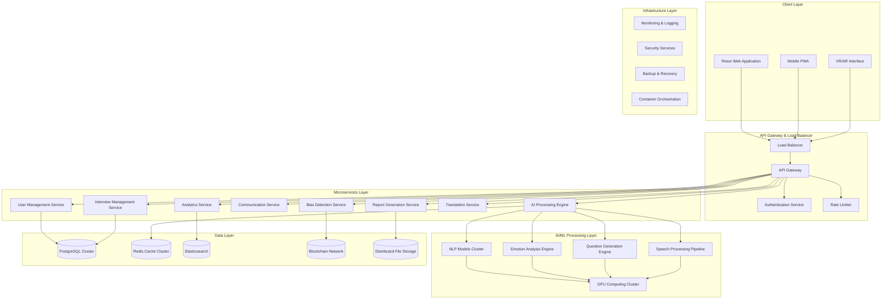
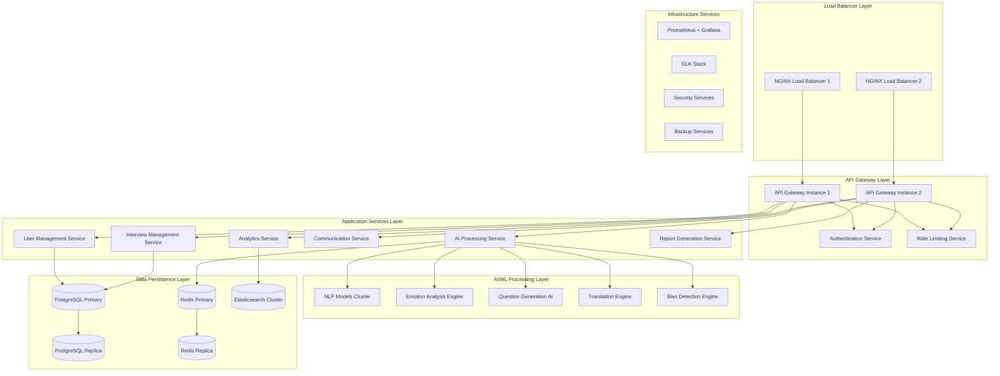
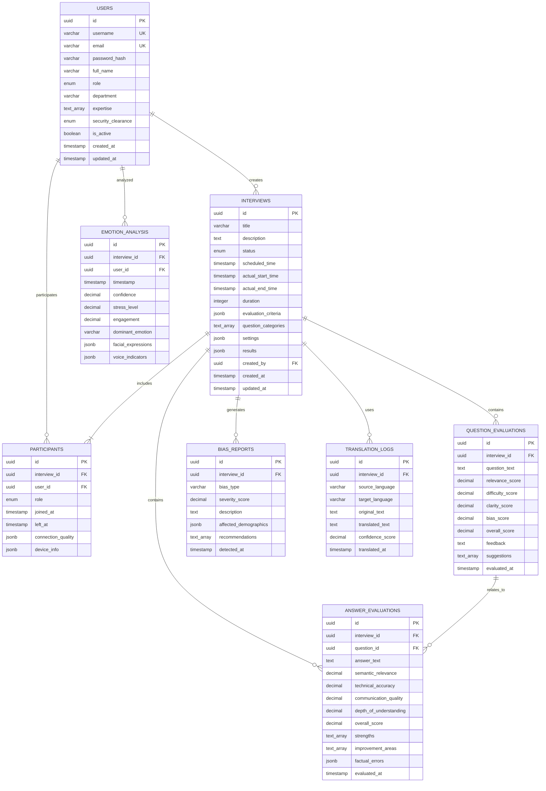

# DRDO AI-Powered Interview & Assessment System - Technical Architecture Document

## 1. Architecture Design



## 2. Technology Description

* **Frontend**: React\@18 + TypeScript + Next.js\@14 + Tailwind CSS + Three.js + Framer Motion+GSAP

* **Backend**: Node.js\@20 + Python\@3.11 + FastAPI + Express.js + Go\@1.21

* **Database**: PostgreSQL\@15 + Redis\@7 + Elasticsearch\@8

* **AI/ML**: PyTorch + Transformers + Sentence-BERT + RoBERTa + T5 + Whisper + OpenCV

* **Communication**: WebRTC + Socket.io + WebSockets

* **Infrastructure**: Docker + Kubernetes + NGINX + Prometheus + Grafana

* **Security**: JWT + OAuth2 + AES-256 + TLS 1.3 + Blockchain (Hyperledger Fabric)

* **Cloud**: On-premise deployment with hybrid cloud capabilities

## 3. Route Definitions

| Route               | Purpose                                            |
| ------------------- | -------------------------------------------------- |
| /                   | Landing page with system overview and login access |
| /auth/login         | Multi-factor authentication portal                 |
| /auth/register      | User registration (admin-controlled)               |
| /dashboard          | Role-based personalized dashboard                  |
| /interviews         | Interview management and scheduling                |
| /interviews/:id     | Individual interview session details               |
| /interview-room/:id | 3D immersive interview environment                 |
| /analytics          | Real-time analytics and performance metrics        |
| /reports            | Comprehensive reporting and data visualization     |
| /questions          | Question bank management and generation            |
| /translation        | Multilingual support configuration                 |
| /admin              | System administration panel                        |
| /security           | Security monitoring and audit trails               |
| /profile            | User profile management                            |
| /help               | Documentation and support resources                |

## 4. API Definitions

### 4.1 Authentication APIs

**Multi-factor Authentication**

```
POST /api/auth/login
```

Request:

| Param Name | Param Type | isRequired | Description                       |
| ---------- | ---------- | ---------- | --------------------------------- |
| username   | string     | true       | User identifier                   |
| password   | string     | true       | User password (hashed)            |
| mfaToken   | string     | false      | Multi-factor authentication token |
| deviceId   | string     | true       | Device identifier for security    |

Response:

| Param Name   | Param Type  | Description                       |
| ------------ | ----------- | --------------------------------- |
| accessToken  | string      | JWT access token                  |
| refreshToken | string      | Refresh token for session renewal |
| user         | UserProfile | Complete user profile information |
| permissions  | string\[]   | User role-based permissions       |
| expiresIn    | number      | Token expiration time in seconds  |

Example:

```json
{
  "username": "selector.drdo@gov.in",
  "password": "hashedPassword123",
  "mfaToken": "123456",
  "deviceId": "device-uuid-12345"
}
```

**Session Management**

```
POST /api/auth/refresh
DELETE /api/auth/logout
GET /api/auth/permissions
```

### 4.2 Interview Management APIs

**Interview Session Operations**

```
POST /api/interviews
GET /api/interviews/:id
PUT /api/interviews/:id/start
PUT /api/interviews/:id/end
POST /api/interviews/:id/participants
```

Request (Create Interview):

| Param Name         | Param Type         | isRequired | Description                    |
| ------------------ | ------------------ | ---------- | ------------------------------ |
| title              | string             | true       | Interview session title        |
| description        | string             | false      | Detailed description           |
| scheduledTime      | ISO8601            | true       | Scheduled start time           |
| duration           | number             | true       | Duration in minutes            |
| participants       | ParticipantInfo\[] | true       | List of participants           |
| evaluationCriteria | EvaluationCriteria | true       | Scoring criteria configuration |
| questionCategories | string\[]          | true       | Question domain categories     |

### 4.3 AI Processing APIs

**Question Evaluation**

```
POST /api/ai/evaluate-question
```

Request:

| Param Name       | Param Type       | isRequired | Description                      |
| ---------------- | ---------------- | ---------- | -------------------------------- |
| question         | string           | true       | Question text to evaluate        |
| candidateProfile | CandidateProfile | true       | Candidate background information |
| jobRequirements  | JobRequirements  | true       | Position requirements            |
| context          | InterviewContext | true       | Current interview context        |

Response:

| Param Name      | Param Type | Description                        |
| --------------- | ---------- | ---------------------------------- |
| relevanceScore  | number     | Domain alignment score (0-1)       |
| difficultyScore | number     | Appropriate difficulty level (0-1) |
| clarityScore    | number     | Question clarity assessment (0-1)  |
| biasScore       | number     | Bias detection score (0-1)         |
| overallScore    | number     | Weighted overall quality score     |
| feedback        | string     | Detailed feedback text             |
| suggestions     | string\[]  | Improvement suggestions            |

**Answer Evaluation**

```
POST /api/ai/evaluate-answer
```

Request:

| Param Name       | Param Type       | isRequired | Description               |
| ---------------- | ---------------- | ---------- | ------------------------- |
| question         | string           | true       | Original question text    |
| answer           | string           | true       | Candidate's response      |
| expectedResponse | string           | false      | Expected answer template  |
| context          | InterviewContext | true       | Interview session context |

**Real-time Translation**

```
POST /api/ai/translate
WebSocket /api/ai/translate/stream
```

**Emotion Analysis**

```
POST /api/ai/analyze-emotion
```

### 4.4 Communication APIs

**WebRTC Signaling**

```
WebSocket /api/communication/signaling/:interviewId
POST /api/communication/ice-candidates
POST /api/communication/offer
POST /api/communication/answer
```

**Real-time Updates**

```
WebSocket /api/interviews/:id/events
```

## 5. Server Architecture Diagram



## 6. Data Model

### 6.1 Data Model Definition



### 6.2 Data Definition Language

**Users Table**

```sql
-- Create custom types
CREATE TYPE user_role AS ENUM ('administrator', 'selector', 'candidate', 'observer');
CREATE TYPE security_level AS ENUM ('public', 'restricted', 'confidential', 'secret');
CREATE TYPE interview_status AS ENUM ('scheduled', 'in_progress', 'completed', 'cancelled', 'technical_issues');

-- Users table
CREATE TABLE users (
    id UUID PRIMARY KEY DEFAULT gen_random_uuid(),
    username VARCHAR(50) UNIQUE NOT NULL,
    email VARCHAR(255) UNIQUE NOT NULL,
    password_hash VARCHAR(255) NOT NULL,
    full_name VARCHAR(255) NOT NULL,
    role user_role NOT NULL,
    department VARCHAR(100),
    expertise TEXT[],
    security_clearance security_level NOT NULL,
    is_active BOOLEAN DEFAULT true,
    created_at TIMESTAMP WITH TIME ZONE DEFAULT NOW(),
    updated_at TIMESTAMP WITH TIME ZONE DEFAULT NOW()
);

-- Interviews table
CREATE TABLE interviews (
    id UUID PRIMARY KEY DEFAULT gen_random_uuid(),
    title VARCHAR(255) NOT NULL,
    description TEXT,
    status interview_status NOT NULL DEFAULT 'scheduled',
    scheduled_time TIMESTAMP WITH TIME ZONE NOT NULL,
    actual_start_time TIMESTAMP WITH TIME ZONE,
    actual_end_time TIMESTAMP WITH TIME ZONE,
    duration INTEGER NOT NULL, -- in minutes
    evaluation_criteria JSONB NOT NULL,
    question_categories TEXT[],
    settings JSONB NOT NULL,
    results JSONB,
    created_by UUID REFERENCES users(id),
    created_at TIMESTAMP WITH TIME ZONE DEFAULT NOW(),
    updated_at TIMESTAMP WITH TIME ZONE DEFAULT NOW()
);

-- Question evaluations table
CREATE TABLE question_evaluations (
    id UUID PRIMARY KEY DEFAULT gen_random_uuid(),
    interview_id UUID REFERENCES interviews(id) ON DELETE CASCADE,
    question_text TEXT NOT NULL,
    relevance_score DECIMAL(3,2) CHECK (relevance_score >= 0 AND relevance_score <= 1),
    difficulty_score DECIMAL(3,2) CHECK (difficulty_score >= 0 AND difficulty_score <= 1),
    clarity_score DECIMAL(3,2) CHECK (clarity_score >= 0 AND clarity_score <= 1),
    bias_score DECIMAL(3,2) CHECK (bias_score >= 0 AND bias_score <= 1),
    overall_score DECIMAL(3,2) CHECK (overall_score >= 0 AND overall_score <= 1),
    feedback TEXT,
    suggestions TEXT[],
    evaluated_at TIMESTAMP WITH TIME ZONE DEFAULT NOW()
);

-- Answer evaluations table
CREATE TABLE answer_evaluations (
    id UUID PRIMARY KEY DEFAULT gen_random_uuid(),
    interview_id UUID REFERENCES interviews(id) ON DELETE CASCADE,
    question_id UUID REFERENCES question_evaluations(id),
    answer_text TEXT NOT NULL,
    semantic_relevance DECIMAL(3,2) CHECK (semantic_relevance >= 0 AND semantic_relevance <= 1),
    technical_accuracy DECIMAL(3,2) CHECK (technical_accuracy >= 0 AND technical_accuracy <= 1),
    communication_quality DECIMAL(3,2) CHECK (communication_quality >= 0 AND communication_quality <= 1),
    depth_of_understanding DECIMAL(3,2) CHECK (depth_of_understanding >= 0 AND depth_of_understanding <= 1),
    overall_score DECIMAL(3,2) CHECK (overall_score >= 0 AND overall_score <= 1),
    strengths TEXT[],
    improvement_areas TEXT[],
    factual_errors JSONB,
    evaluated_at TIMESTAMP WITH TIME ZONE DEFAULT NOW()
);

-- Emotion analysis table
CREATE TABLE emotion_analysis (
    id UUID PRIMARY KEY DEFAULT gen_random_uuid(),
    interview_id UUID REFERENCES interviews(id) ON DELETE CASCADE,
    user_id UUID REFERENCES users(id),
    timestamp TIMESTAMP WITH TIME ZONE NOT NULL,
    confidence DECIMAL(3,2) CHECK (confidence >= 0 AND confidence <= 1),
    stress_level DECIMAL(3,2) CHECK (stress_level >= 0 AND stress_level <= 1),
    engagement DECIMAL(3,2) CHECK (engagement >= 0 AND engagement <= 1),
    dominant_emotion VARCHAR(50),
    facial_expressions JSONB,
    voice_indicators JSONB
);

-- Create indexes for performance
CREATE INDEX idx_users_role ON users(role);
CREATE INDEX idx_users_department ON users(department);
CREATE INDEX idx_interviews_status ON interviews(status);
CREATE INDEX idx_interviews_scheduled_time ON interviews(scheduled_time);
CREATE INDEX idx_question_evaluations_interview_id ON question_evaluations(interview_id);
CREATE INDEX idx_answer_evaluations_interview_id ON answer_evaluations(interview_id);
CREATE INDEX idx_emotion_analysis_interview_id ON emotion_analysis(interview_id);
CREATE INDEX idx_emotion_analysis_timestamp ON emotion_analysis(timestamp);

-- Insert initial data
INSERT INTO users (username, email, password_hash, full_name, role, department, security_clearance) VALUES
('admin.drdo', 'admin@drdo.gov.in', '$2b$12$hashedpassword', 'System Administrator', 'administrator', 'IT', 'secret'),
('selector.aero', 'selector.aero@drdo.gov.in', '$2b$12$hashedpassword', 'Aeronautics Selector', 'selector', 'Aeronautics', 'confidential'),
('candidate.001', 'candidate001@example.com', '$2b$12$hashedpassword', 'Test Candidate', 'candidate', 'External', 'public');
```

## 7. Security Architecture

### 7.1 Authentication & Authorization

* **Multi-Factor Authentication**: SMS OTP, TOTP, biometric authentication

* **JWT Tokens**: Short-lived access tokens (15 minutes) with refresh tokens (7 days)

* **Role-Based Access Control**: Granular permissions based on user roles and security clearance

* **Session Management**: Secure session handling with automatic timeout and concurrent session limits

### 7.2 Data Protection

* **Encryption at Rest**: AES-256 encryption for all sensitive data

* **Encryption in Transit**: TLS 1.3 for all communications

* **Key Management**: Hardware Security Modules (HSM) for key storage

* **Data Anonymization**: Differential privacy for analytics and reporting

### 7.3 Network Security

* **Zero Trust Architecture**: Every request authenticated and authorized

* **API Rate Limiting**: Configurable rate limits per user role and endpoint

* **DDoS Protection**: Multi-layer DDoS mitigation strategies

* **Network Segmentation**: Isolated network zones for different service tiers

### 7.4 Audit & Compliance

* **Blockchain Audit Trail**: Immutable record of all system activities

* **Compliance Monitoring**: Automated compliance checking for GDPR, ISO 27001

* **Security Incident Response**: Automated threat detection and response

* **Regular Security Audits**: Penetration testing and vulnerability assessments

## 8. Deployment & Scalability

### 8.1 Container Orchestration

* **Kubernetes**: Container orchestration with auto-scaling capabilities

* **Docker**: Containerized microservices for consistent deployment

* **Helm Charts**: Standardized deployment configurations

* **Service Mesh**: Istio for service-to-service communication security

### 8.2 Auto-Scaling Strategy

* **Horizontal Pod Autoscaler**: CPU and memory-based scaling

* **Vertical Pod Autoscaler**: Resource optimization for individual pods

* **Cluster Autoscaler**: Node-level scaling based on demand

* **Custom Metrics**: AI workload-specific scaling metrics

### 8.3 High Availability

* **Multi-Zone Deployment**: Services distributed across availability zones

* **Database Replication**: Master-slave PostgreSQL configuration

* **Load Balancing**: NGINX with health checks and failover

* **Disaster Recovery**: Automated backup and recovery procedures

### 8.4 Monitoring & Observability

* **Metrics**: Prometheus for metrics collection and alerting

* **Logging**: ELK stack for centralized log management

* **Tracing**: Jaeger for distributed tracing

* **Dashboards**: Grafana for real-time monitoring and visualization

